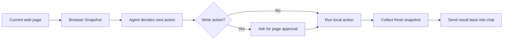

# BrowseVibe

**A browser agent for the web, under your control.**

BrowseVibe is a local-first Chrome side panel that lets an agent observe the page, request browser actions, and execute them only after explicit user approval.

This repository contains the open-source local core:

- Chrome extension UI
- page snapshots of visible interactive elements
- local `browser.snapshot`, `browser.extract`, `browser.click`, and `browser.type`
- per-page approval for write actions
- direct WebSocket connection to a local PicoClaw gateway

Hosted sync, shared workflows, audit logs, remote runs, and team controls are intentionally out of scope for this repository.

## Why BrowseVibe

Most browser AI products lean toward one of two extremes:

- a generic AI sidebar that can read pages but does not control them well
- a powerful cloud agent that can act on the web, but outside the browser you are actually using

BrowseVibe takes a different path:

- `local-first`: the extension runs in your browser
- `current-page aware`: it works from the page you are already on
- `approval-gated`: `click` and `type` require page-scoped approval
- `inspectable`: the agent works from a visible Browser Snapshot

The goal is not invisible automation. The goal is a controlled browser agent you can trust.

## How It Works



The local bridge inside the extension is split across three parts:

- `background.js`: enforces the active-tab boundary and page-scoped approval
- `content.js`: collects DOM snapshots and runs page actions
- `sidebar.js`: shows chat, approval UI, and Browser Snapshot state

## Current Scope

What works today:

- direct PicoClaw chat over the Pico protocol
- current tab title, URL, selection, and headings injected as prompt context
- snapshots of visible interactive elements on the active page
- local browser actions:
  - `browser.snapshot`
  - `browser.extract`
  - `browser.click`
  - `browser.type`
- one-time, per-page approval for `click` and `type`
- sensitive-field blocking for obviously dangerous inputs such as password or payment-style fields

What is not implemented yet:

- cross-tab browser automation
- multi-agent routing
- rich transcript history sync from PicoClaw
- hosted cloud features

## Quick Start

### 1. Prerequisites

You need:

- Chrome or another Chromium browser with side panel support
- a running local PicoClaw gateway
- the effective gateway Pico token

### 2. Load the extension

1. Open `chrome://extensions`
2. Enable `Developer mode`
3. Click `Load unpacked`
4. Select the `extension/` folder from this repository
5. Click the extension action to open the side panel

### 3. Configure the local gateway

In the BrowseVibe settings panel, enter:

- `Gateway WS URL`
  Example: `ws://127.0.0.1:18790/pico/ws`
- `Gateway Pico Token`
  The effective PicoClaw gateway token, not a launcher token

BrowseVibe talks directly to PicoClaw's native Pico protocol endpoint:

- gateway WebSocket: `ws://<host>:<port>/pico/ws`
- session routing: `?session_id=<id>`
- auth: `Sec-WebSocket-Protocol: token.<gateway-pico-token>`

No local helper process is required.

## Assistant Action Format

When the model wants to act on the page, it should respond with exactly one fenced `browser-action` JSON block.

Example:

````text
```browser-action
{"action":"browser.click","target":{"elementId":"el-2","selector":"button[data-testid=\"continue\"]"}}
```
````

Supported actions:

- `browser.snapshot`
- `browser.extract`
- `browser.click`
- `browser.type`

For `click` and `type`, the extension will:

1. ask for approval once on the current page if needed
2. execute the action on the active tab only
3. collect a fresh browser snapshot
4. send the result back into the chat as a follow-up user message

## Security Model

BrowseVibe keeps the open-source core intentionally narrow:

- browser actions are limited to the active HTTP(S) tab
- write actions require one-time approval on the current page
- obviously sensitive inputs are blocked from `browser.type`
- configuration and session state stay in `chrome.storage.local`

See [PRIVACY.md](./PRIVACY.md) and [SECURITY.md](./SECURITY.md) for the current posture.

## Open-Source Boundary

This repository is for the local extension core.

Good fits for this repo:

- local execution logic
- page snapshot quality
- approval UX
- safety boundaries
- extension packaging and local development

Not part of this repo's scope:

- hosted memory and cloud sync
- shared team workspaces
- audit logs and admin controls
- remote browser fleets
- metered hosted inference

That split is intentional. The open-source layer should be the part users need to inspect and trust.

## Roadmap

Near-term priorities:

- better snapshot quality for forms and grouped controls
- better action result reporting after `click` and `type`
- first-class upload and download flows
- cross-page workflow support with clear approval boundaries
- cleaner setup for PicoClaw token bootstrapping

## Contributing

Contributions are welcome, especially in:

- browser safety and approval UX
- DOM extraction and action reliability
- Chrome extension ergonomics
- documentation and developer onboarding

If you plan to change action semantics or security boundaries, please open an issue first so the behavior stays coherent.

## License

Apache-2.0. See [LICENSE](./LICENSE).
